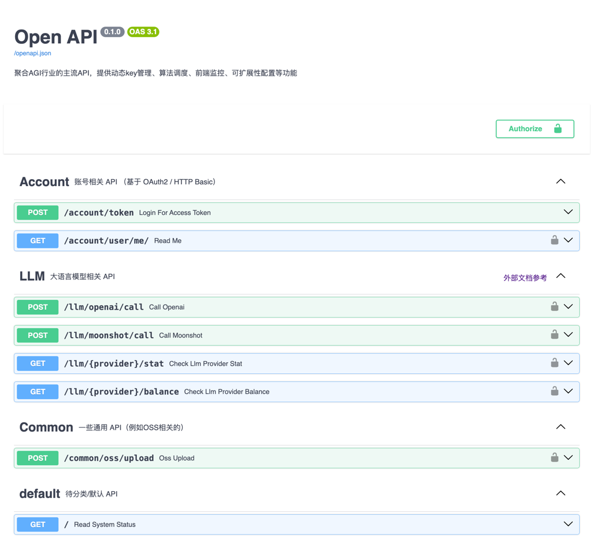
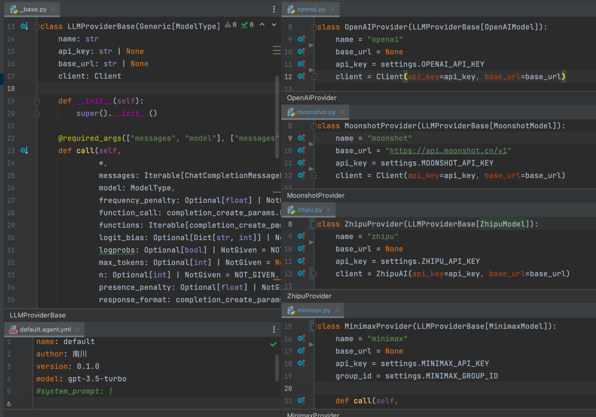

# Open API





## TODO

- [ ] specific scenario-based prompt
- [ ] user management on database
- [ ] callable robuster api

## Features

- [x] supported compress-content algo (2024-03-31)
- [x] supported zhipu / minimax API (2024-03-31)
- [x] supported agent call (2024-03-30)
- [x] supported openai / moonshot API (2024-03-28)

## Configuration

config your `.env` like `.env.sample`

```shell
poetry shell
poetry install
poetry run fastapi run --port 41110
```

## Run

访问 `http://localhost:41110/docs` 查看各 API。

## Deploy

### proxy

```shell
pm2 start --name "openapi" 'http_proxy=http://localhost:7890 https_proxy=http://localhost:7890 uvicorn auth:app --port 40330'
```

## Tech

### drivers

- ubuntu 安装 stable driver（必要）：https://chat.openai.com/c/3b9d2211-7a26-4fc1-afdc-dd46025e80cb
- 手动选择下载 driver（非必要）： https://googlechromelabs.github.io/chrome-for-testing/#stable

## Bugfix

### Wechaty - FileBox

文件发送问题，参考：https://github.com/wechaty/python-wechaty/issues/356#issuecomment-1228024344
，代码见 `packages/common_wechat/patches/filebox.py`

### NotGiven

如果不加这个的话，swagger 里会显示为 null
